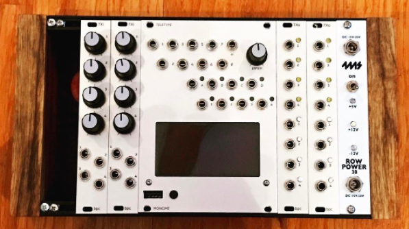
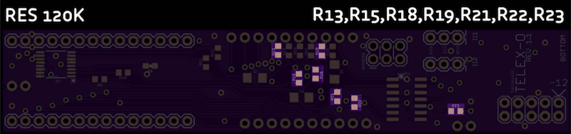

# TELEX EURORACK EXPANDERS

The TELEX are a family of eurorack expanders that were initially designed to interface with the Monome Teletype to provide additional inputs and outputs. Utilizing the `II` bus (i2c) and having a flexible command set, there is no reason that these modules couldn't connect and extend other Monome Eurorack devices (even non-Eurorack devices that support II like the Aleph) or your own hardware projects.

Follow the conversation at [llllllll](http://llllllll.co/t/a-teletype-expander/1379).

## The Modules

The TELEXo (or TXo) is an output expander and the TELEXi (or TXi) is an input expander. They have little jumpers on the back so you can hook more than one of each module to your Teletype simultaneously. (Theoretically, up to eight of each type - though I’ve only tested six total modules at a time thus far. There will be a limit based on the II bus resistance - not sure what it is yet.)

* **TELEXo (TXo)**: a 4HP output module that provides 4 trigger outputs and 4 CV outputs addressable over `II`. Up to 8 can be independently addressed by the Teletype.

* **TELEXi (TXi)**: a 4HP input module that provides 4 control voltage potentiometers and 4 independent control voltage inputs. Up to 8 can be independently addressed by the Teletype.

## Teletype Firmware

We recommend the Teletype 2.0 BETA at this point. You can get it from this forum:

https://llllllll.co/t/teletype-2-0-beta-release-candidate-1-released-6th-june-2017/6939?u=bpcmusic

It is the bomb.

You can always head to Monome for the latest [Official Teletype Firmware](https://github.com/monome/teletype).

## TELEX Firmware

Download the latest TELEX firmware from the releases section of this site:

https://github.com/bpcmusic/telex/releases

### Installing Your Firmware

> **DO NOT POWER YOUR MODULE WHILE CONNECTING THE TEENSY VIA USB TO YOUR COMPUTER - THIS WOULD BE VERY BAD**

Ok. With that out of the way, here are some simple steps.

Firmware is loaded on the Teensy processor that piggybacks on the underside of your module. Doing so is pretty simple.

1. Download the Teensy Loader application for your operating system from https://www.pjrc.com/teensy/loader.html (if you don't have it already)
2. Download and unzip the latest TELEX firmware from https://github.com/bpcmusic/telex/releases
3. (optional) Carefully remove the Teensy from your module
4. Connect the Teensy to your computer via USB
5. Use your operating system specific instructions for the Teensy Loader to open the appropriate firmware in the Teensy loader and program it on your Teensy
6. Disconnect the Teensy from USB when the firmware has been loaded
7. Reattach the Teensy to your module if you removed it (USB port on the Teensy goes towards the top of the PCB)
8. Party.

### Compiling Your Own Firmware

Compiling the TELEX firmware is done using the [Arduino Development Environment](https://www.arduino.cc/en/Main/Software) and a few extensions.

* [Arduino Development Environment](https://www.arduino.cc/en/Main/Software)
* [Teensy-duino Add-On](https://www.pjrc.com/teensy/td_download.html)
* [i2c_t3 Library for Teensy](https://forum.pjrc.com/threads/21680-New-I2C-library-for-Teensy3)

Several additional libraries are included in the project due to the Arduino IDE's wonderful linking capabilities.

	IMPORTANT: overclock your Teensy to 120 MHz in the IDE

### Critical Startup Optimization for Compilation
	
If you want your TELEX to be ready when your Teletype has booted and is sending out the `I` script for the program that it is loading at startup, you need to make a change to the Teensy file "pins_teensy.c" in your Arduino hardware folder. For my mac, this is inside of the Arduino application package in:

`Contents\Java\hardware\teensy\avr\cores\teensy3\pins_teensy.c`

Line 585 has the value `delay(400)`; reduce this to an amount of delay that is appropriate for you needed startup time. For the official firmware, we set this to `delay(175)` which should be more than enough to beat the fast-loading, 2.0 firmware to the ready.

For now, we edit this in-place. I know. We shuddered too. But, that seems to be the best way to make the change. Remember, you need to change it back for any other Arduino compilation you plan to do as it may have the device ready before all of your related components are - including the Teensy's USB interface.

## TELEX Command Reference

Reference documents for the commands supported by the TXo and TXi are located here:

* [Markdown Command Reference with Extra Descriptions](commands.md)
* [Printable Command Reference](extras/TELEX%20Command%20Reference.pdf)

The documents are a little behind the latest firmware; we're moving all operator definitions into the 2.0 documentation system which **is** up to date.

The latests ops are mentioned in this forum post, if you are curious. You need the 2.0 beta firmware (mentioned above) to access them.

https://llllllll.co/t/telex-teletype-expanders/1379/609?u=bpcmusic

## TELEXo

Each 4HP module adds 4 Trigger outputs and 4 Control Voltage outputs. 

All Teletype output functionality is supported by the TXo. Operators are near-identical for basic functionality, just put a "TO.” in front of the set you already know. The outputs are a little different; the triggers are +5V triggers and the CV outputs are bipolar (-10V to +10v) with 16 bit resolution over that range.

Extended functionality of the TXo starts with being able to specify longer values for slew and pulse times (in seconds and minutes). 

The TXo has the following “experimental” features for each of its four TR outputs:

- Configurable pulse dividers for each output
- Independent metronomes for each output that will pulse each output at intervals that can be set in milliseconds, seconds, minutes, and beats per minute (BPM)

The TXo also has the following “experimental” features for each of its four CV outputs:

- a quantizer with a dozen or so microtonal scales in addition to equal temperament
- an oscillator (not currently band-limited) that supports frequencies from LFO rates up to around 8kHz with variable morphing waveforms (sine, triangle, saw, variable width square, and noise), adjustable phase offset, and frequency slew (portamento)
- an AR (attack + release) envelope generator with times in milliseconds, seconds and minutes

These extended features, when combined together, can really push the envelope of the TXo’s processor and do some crazy stuff. For example: the output's envelope generator can act as a VCA, which turns the expander into a little 4-voice synth.

#### Links:

* [TXo Arduino Firmware](software/TELEXo)
* [TXo Module PCB](hardware/TELEXo/board)
* [TXo Module BOM](hardware/TELEXo/board/TELEXo-BOM.xlsx)
* [TXo 4HP Module Panel](hardware/TELEXo/panel)

## TELEXi

Each 4HP module adds 4 IN jacks and 4 PARAM knobs. 

* The IN jacks are bipolar (-10V to +10V).
* They jacks and knobs just like the Teletype IN and PARAM operators (TI.IN and TI.PARAM). 
* The TXi has some extended functionality where the TXi can do quantization for you and return note numbers against any one of its internal scales (there are about 12 or so). 
* Inputs are sampled with 13bit resolution.

#### Links:

* [TXo Arduino Firmware](software/TELEXi)
* [TXo Module PCB](hardware/TELEXi/board)
* [TXo Module BOM](hardware/TELEXi/board/TELEXi-BOM.xlsx)
* [TXo 4HP Module Panel](hardware/TELEXi/panel)

## Addressing Multiple TELEX Modules

Multiple TELEX modules are addressed using jumpers on the back of the unit. Theoretically, you can have up to eight of each type of unit on the same II bus. The addresses are non-conflicting between module types. For example, if you have one of each module, each would be unit #1 of that type and neither would have any address jumpers set.

The jumpers are oriented vertically and the rows are numbered from top to bottom:

* Row 1
* Row 2
* Row 3

Placing jumpers on rows in the following sequence allows you to designate the unit # (which is the binary representation of the rows plus one). X indicates the placement of a jumper.

| Row 1 | Row 2 | Row 3 | Unit # | Inputs/Outputs |
| --- | --- | --- | --- | --- |
| 0 | 0 | 0 | 1 | 1-4 |
| X | 0 | 0 | 2 | 5-8 |
| 0 | X | 0 | 3 | 9-12 |
| X | X | 0 | 4 | 13-16 |
| 0 | 0 | X | 5 | 17-20 |
| X | 0 | X | 6 | 21-24 |
| 0 | X | X | 7 | 25-28 |
| X | X | X | 8 | 28-32 |

## DIY Tips and Warnings

The modules are made up with two boards stacked on top of each other and a Teensy 3.2 riding piggyback. They are primarily 603 SMD parts with a few 805, 1206 and SMD ICs thrown in for good measure. If you have assembled any of mxmxmx’s DIY modules (Ornament + Crime, Terminal Tedium, etc.) you should have no problem with the expanders. They are not, however, a beginners project for SMD.

The DAC that is used for the TXo is the DAC8564 (Mouser P/N: 595-DAC8564ICPW; datasheet: http://www.ti.com/product/DAC8564). This part is used by a number of Eurorack modules - including Mutable's *Yarns* and *Ornament + Crime* by mxmxmx. It has tiny little SMD legs that can cause DIY cursing. ;)

#### Use the Build Maps

The build maps are PDF files that have one page per component per side per board showing you all the places that component goes. This saves a ton of time and avoids the pain-in-the-ass component hunt. They are linked below - but check out the example below:

Thanks to [c1t1zen](https://www.instagram.com/c1t1zen/) for the idea. :)

#### Crazy Board Naming

I have a goofy naming convention for the boards. It is confusing. But, I embraced the organic silliness. The "Top" Board is the one behind the panel. The "Bottom" Board is the one facing the back of your case. The side of the board with the name of the unit and board on it is considered the "Top" of the board. The other side is considered the bottom. This means The boards and sides are like this:

- **Top Top** - facing the panel; has the jacks, pots and LEDs
- **Top Bottom** - the back-side of the one facing the panel with a small handful of components
- **Bottom Bottom** - faces the Top Bottom on the "back board" of the unit
- **Bottom Top** - faces the back of your case; has the Teensy, power and jumpers mounted on it

Stupid, I know. But it makes a certain kind of back assward sense.

#### Balancing Headers IMPORTANT

In addition to the two signal headers that connect the boards, there are a pair of two pin connectors that provide balance at the top and the bottom of the boards. Keep the following tips in mind:

> The top connector for both modules needs to be installed before the component that it sits behind it is placed. The header pins on the Top Top side should be as near flush as possible. They aid in connecting both boards ground planes, so you don't want them shorting out to the jack (TXo) or the potentiometer (TXi). I actually trim them to be board-level prior to soldering so that they are as flat as possible. I also bend the front foot of the potentiometer (TXi) out of the way a bit so as to avoid contact.

#### Stencil Frames are your Friends

There are a bunch of 3D printable frames available for you to help your build process. As there are SMD components on both sides of the three of the four boards across the two modules, these frames help lay the boards flat for the application of solder paste and/or manual soldering of the components. They save you a ton of time and frustration. They are your friends.

There are also MULTI files for three of the dual-sided boards that will help you hold eight boards next to each other at a time. These are really handy if you are building in bulk. All of the files are in the stencil_frame folders inside of the hardware / board folders.

3D Prints were tested on a Prusa i3 MK2 with PLA filament.

### TXi Build Files

[Explore the repository for all kinds of support files](hardware/TELEXi). Here are some of the key ones:

* [TXi Schematic](hardware/TELEXi/board/Telex-I%20Schematic.pdf)
* [TXi Gerbers Top](hardware/TELEXi/board/gerbers/TI-TOP-1.1.zip)
* [TXi Gerbers Bottom](hardware/TELEXi/board/gerbers/TI-BOT%201.1A.zip)
* [TXi BOM](hardware/TELEXi/board/TELEXi-BOM.xlsx)
* [TXi Bottom Top Build Map](hardware/TELEXi/board/build_map/bt/txi_bt_build_map.pdf)
* [TXi Bottom Bottom Build Map](hardware/TELEXi/board/build_map/bb/txi_bb_build_map.pdf)
* [TXi Top Top Build Map](hardware/TELEXi/board/build_map/tt/txi_tt_build_map.pdf)
* [TXi Top Bottom Build Map](hardware/TELEXi/board/build_map/tb/txi_tb_build_map.pdf)
* [TXi Panel Files](hardware/TELEXi/panel)
* [TXi Stencil Frames](hardware/TELEXi/board/stencil_frame)

### TXo Build Files

[Explore the repository for all kinds of support files](hardware/TELEXo). Here are some of the key ones:

* [TXo Schematic](hardware/TELEXo/board/Telex-O%20Schematic.pdf)
* [TXo Gerbers Top](hardware/TELEXo/board/gerbers/TO-TOP-1.1.zip)
* [TXo Gerbers Bottom](hardware/TELEXo/board/gerbers/TO-BOT-1.1.zip)
* [TXo BOM](hardware/TELEXo/board/TELEXo-BOM.xlsx)
* [TXo Bottom Top Build Map](hardware/TELEXo/board/build_map/bt/txo_bt_build_map.pdf)
* [TXo Bottom Bottom Build Map](hardware/TELEXo/board/build_map/bb/txo_bb_build_map.pdf)
* [TXo Top Top Build Map](hardware/TELEXo/board/build_map/tt/txo_tt_build_map.pdf)
* [TXo Top Bottom Build Map](hardware/TELEXo/board/build_map/tb/txo_tb_build_map.pdf)
* [TXo Panel Files](hardware/TELEXo/panel)
* [TXo Stencil Frames](hardware/TELEXo/board/stencil_frame)

## Thanks
* Brian Crabtree and Kelli Cain for creating [Monome](http://monome.org) and their awesome, open Eurorack modules (including the Teletype which started this all).

* [Galapagoose](http://llllllll.co/users/galapagoose/activity) for being an endlessly patient mentor helping get the circuit design and layout sorted. These modules wouldn't exist without his help.

* [Tom Erbe](http://www.soundhack.com/) for teaching me all about this stuff at CalArts back in the dark ages.

* Ezra Buchla and Brian for birthing the beautiful and ambitious Aleph and endowing it with an `II` jack.

* Tom Whitwell of [Music Thing Modular](http://musicthing.co.uk/modular/) and his open sharing of the Teensy 3.1 powered, Bad-Assed [RadioMusic](https://github.com/TomWhitwell/RadioMusic/wiki).

* Olivier Gillet at [Mutable Instruments](http://mutable-instruments.net/) for his fantastic modules, excellent design, impressive implementation skills and commitment to open hardware. 

* Jim Matheson of Neutron Sound and his fantastic Teensy 3.1 powered [Orgone Accumulator](http://neutron-sound.com/noa.html).

* PJRC for making the awesome [Teensy](https://www.pjrc.com/teensy/index.html).

* The community at [llllllll](http://llllllll.co) for being so supportive and patient as I've lumbered my way through making these things.

---

These modules are open source. Hardware is released under the cc-by-sa-4.0 license and the source code is released under the MIT license.
