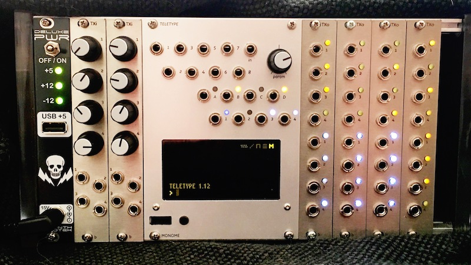

# TELEX EURORACK EXPANDERS

The TELEX are a family of eurorack expanders that were initially designed to interface with the Monome Teletype to provide additional inputs and outputs. Utilizing the `II` bus (i2c) and having a flexible command set, there is no reason that these modules couldn't connect and extend other Monome Eurorack devices (even non-Eurorack devices that support II like the Aleph) or your own hardware projects.

Follow the conversation at [llllllll](http://llllllll.co/t/a-teletype-expander/1379).

## The Modules

The TELEXo (or TXo) is an output expander and the TELEXi (or TXi) is an input expander. They have little jumpers on the back so you can hook more than one of each module to your Teletype simultaneously. (Theoretically, up to eight of each type - though I’ve only tested six total modules at a time thus far. There will be a limit based on the II bus resistance - not sure what it is yet.)

* **TELEXo (TXo)**: a 4HP output module that provides 4 trigger outputs and 4 CV outputs addressable over `II`. Up to 8 can be independently addressed by the Teletype.

* **TELEXi (TXi)**: a 4HP input module that provides 4 control voltage potentiometers and 4 independent control voltage inputs. Up to 8 can be independently addressed by the Teletype.

## Teletype Firmware

Until the TELEX support is merged into the Teletype firmware, you can grab and compile a version of the TT firmware that supports the TELEX modules from this fork: [Teletype Fork Supporting TELEX Modules](https://github.com/bpcmusic/teletype).

## TELEX Firmware

Compiling the TELEX firmware is done using the [Arduino Development Environment](https://www.arduino.cc/en/Main/Software) and a few extensions.

* [Arduino Development Environment](https://www.arduino.cc/en/Main/Software)
* [Teensy-duino Add-On](https://www.pjrc.com/teensy/td_download.html)
* [i2c_t3 Library for Teensy](https://forum.pjrc.com/threads/21680-New-I2C-library-for-Teensy3)

Several additional libraries are included in the project due to the Arduino IDE's wonderful linking capabilities.

	IMPORTANT: overclock your Teensy to 120 MHz in the IDE

## TELEX Command Reference

A markdown file containing the commands supported by the TXo and TXi is located here: [TELEX Command Reference](commands.md).

## TELEXo

Each 4HP module adds 4 Trigger outputs and 4 Control Voltage outputs. 

All Teletype output functionality is supported by the TXo. Operators are near-identical for basic functionality, just put a "TO.” in front of the set you already know. The outputs are a little different; the triggers are +5V triggers and the CV outputs are bipolar (-10V to +10v) with 16 bit resolution over that range.

Extended functionality of the TXo starts with being able to specify longer values for slew and pulse times (in seconds and minutes). 

The TXo also has the following “experimental” features for each of its four CV outputs:

- a quantizer with a dozen or so microtonal scales in addition to equal temperament
- an oscillator (not currently band-limited) that supports frequencies from LFO rates up to around 8kHz with variable waveforms (sine, triangle, saw, variable width square, and noise), and frequency slew (portamento)
- an AR (attack + release) envelope generator with times in milliseconds, seconds and minutes

These extended features, when combined together, can really push the envelope of the TXo’s processor and do some crazy stuff. For example: the output's envelope generator can act as a VCA, which turns the expander into a little 4-voice synth.

####Links:

* [TXo Arduino Firmware](software/TELEXo)
* [TXo Module PCB](hardware/TELEXo/board)
* [TXo Module BOM](hardware/TELEXo/board/TELEXo-BOM.xlsx)
* [TXo 4HP Module Panel](hardware/TELEXo/panel)

## TELEXi

Each 4HP module adds 4 IN jacks and 4 PARAM knobs. 

* The IN jacks are bipolar (-10V to +10V).
* They jacks and knobs just like the Teletype IN and PARAM operators (TI.IN and TI.PARAM). 
* The TXi has some extended functionality where the TXi can do quantization for you and return note numbers against any one of its internal scales (there are about 12 or so). 
* Inputs are sampled with 13bit resolution.

####Links:

* [TXo Arduino Firmware](software/TELEXi)
* [TXo Module PCB](hardware/TELEXi/board)
* [TXo Module BOM](hardware/TELEXi/board/TELEXi-BOM.xlsx)
* [TXo 4HP Module Panel](hardware/TELEXi/panel)

## DIY

The modules are made up with two boards stacked on top of each other and a Teensy 3.2 riding piggyback. They are primarily 603 SMD parts with a few 805, 1206 and SMD ICs thrown in for good measure. If you have assembled any of mxmxmx’s DIY modules (Ornament + Crime, Terminal Tedium, etc.) you should have no problem with the expanders. They are not, however, a beginners project for SMD.

The DAC that is used for the TXo is the DAC8564 (Mouser P/N: 595-DAC8564ICPW; datasheet: http://www.ti.com/product/DAC8564). This part is used by a number of Eurorack modules - including Mutable's *Yarns* and *Ornament + Crime* by mxmxmx. It has tiny little SMD legs that can cause DIY cursing. ;)

## Thanks
* Brian Crabtree and Kelli Cain for creating [Monome](http://monome.org) and their awesome, open Eurorack modules (including the Teletype which started this all).

* [Galapagoose](http://llllllll.co/users/galapagoose/activity) for being an endlessly patient mentor helping get the circuit design and layout sorted. These modules wouldn't exist without his help.

* Ezra Buchla and Brian for birthing the beautiful and ambitious Aleph and endowing it with an `II` jack.

* Tom Whitwell of [Music Thing Modular](http://musicthing.co.uk/modular/) and his open sharing of the Teensy 3.1 powered, Bad-Assed [RadioMusic](https://github.com/TomWhitwell/RadioMusic/wiki).

* Olivier Gillet at [Mutable Instruments](http://mutable-instruments.net/) for his fantastic modules, excellent design, impressive implementation skills and commitment to open hardware. 

* Jim Matheson of Neutron Sound and his fantastic Teensy 3.1 powered [Orgone Accumulator](http://neutron-sound.com/noa.html).

* PJRC for making the awesome [Teensy](https://www.pjrc.com/teensy/index.html).

* The community at [llllllll](http://llllllll.co) for being so supportive and patient as I've lumbered my way through making these things.

---

These modules are open source. Hardware is released under the cc-by-sa-4.0 license and the source code is released under the MIT license.